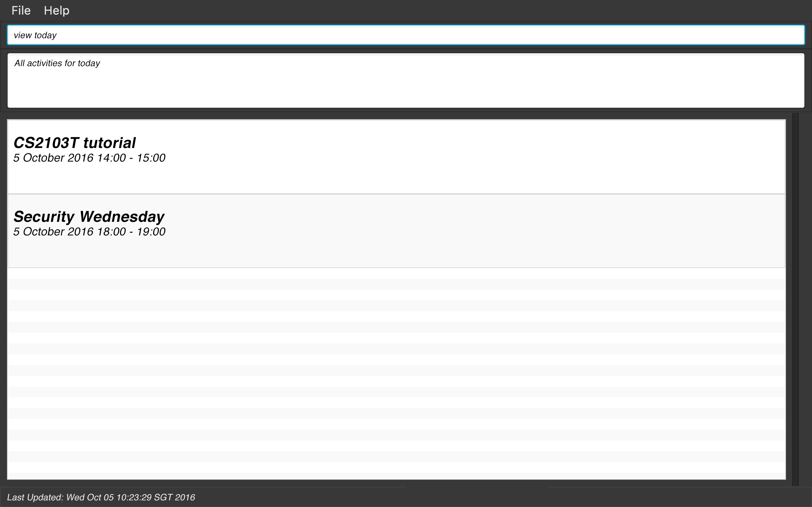

# Remindaroo

 

Find it hard to keep track of deadlines and important dates? Prefer to use intuitive keyboard input for your todo-list application?

**Fret not, Remindaroo is here for you!**

Remindaroo is a CLI (Command Line Interface) application developed for the CS2103T project. It features a basic GUI (Graphic User Interface) focusing on intuitive keyboard commands to establish a more efficient workflow for our users.

**_~With Remindaroo, all you need is to do~_**

#### Site Map
* [User Guide](docs/UserGuide.md)
* [Developer Guide](docs/DeveloperGuide.md)
* [About Us](docs/AboutUs.md)

#### Acknowledgements

* The sample project is created by [SE-EDU initiative](https://github.com/se-edu/)
* Some parts of this sample application were inspired by the excellent
  [Java FX tutorial](http://code.makery.ch/library/javafx-8-tutorial/) by *Marco Jakob*.
* We would also like to acknowledge the developers of [Address Book Level 4](https://github.com/nus-cs2103-AY1617S1/addressbook-level4) for providing the code base for developing this application, and the developers of the [Natty](http://natty.joestelmach.com/) library for providing a friendly interface for handling dates and times.
* We would also like to thank our mentor Chun Rong, who has provided us with valuable guidance throughout the course of this project.

#### Licence : [MIT](LICENSE)
