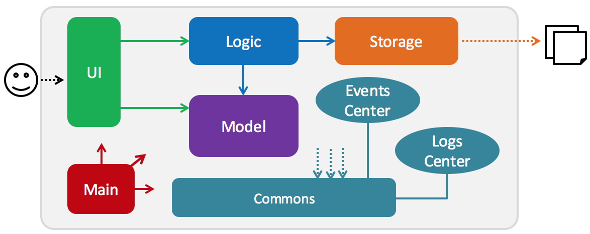
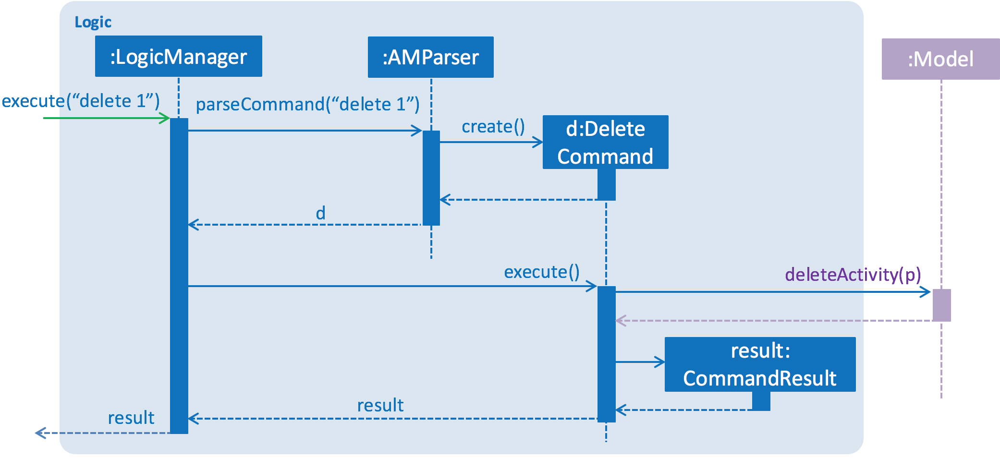

# Developer Guide

## Table of Contents

1. [Introduction](#1-introduction)
2. [Setup](#2-setup)
3. [Design](#3-design)  
    3.1 [Architecture](#3.1-architecture) 
    3.2 [UI Component](#3.2-UI-component) 
    3.3 [Logic Component](#3.3-logic-component) 
    3.4 [Model Component](#3.4-model-component) 
    3.5 [Storage Component](#3.5-storage-component) 
    3.6 [CommonClasses](#3.6-common-classes) 
4. [Implementation](#4-implementation)  
    4.1 [Logging](#4.1-logging) 
    4.2 [Configuration](#4.2-configuration)  
5. [Testing](#5-testing)
6. [Dev Ops](#6-dev-ops)  
    6.1 [Build Automation](#6.1-build-automation) 
    6.2 [Continuous Integration](#6.2-continuous-integration) 
    6.3 [Making a release](#6.3-making-a-release) 
    6.4 [Managing dependencies](#6.4-managing-dependencies) 
7. [Appendices](#7-appendices)  
    A. [User Stories](#a-user-stories) 
    B. [Use Cases](#b-use-cases) 
    C. [Non-Functional Requirements](#c-non-functional-requirements) 
    D. [Product Survey](#d-product-survey) 
    E. [Glossary](#e-glossary) 

## 1. Introduction

Remindaroo is an activity manager that helps users track tasks, deadlines, as well as events. It is a Java command line interface (CLI) application with a basic graphic user interface (GUI).

This guide describes the design and implementation of Remindaroo. It provides further details related to Remindaroo’s development, allowing you to better contribute to our project. We have organized this guide in a top-down manner to help you comprehend the bigger picture before proceeding on to more detailed sections.

## 2. Setup

#### Prerequisites

1. **JDK `1.8.0_60`**  or later 

    >Note:  
    >  Having any Java 8 version is not enough. 
    This app will not work with earlier versions of Java 8.

2. **Eclipse** IDE
    > Note:  
    > Eclipse Neon is required. This app will not work with older versions of Eclipse.

3. **e(fx)clipse** plugin for Eclipse (Do the steps 2 onwards given in
   [this page](http://www.eclipse.org/efxclipse/install.html#for-the-ambitious))
   
4. **Buildship Gradle Integration** plugin from the Eclipse Marketplace

In addition, we also recommend the following software to assist you in development: 
1. Eclemma plugin for Eclipse to analyse test coverage locally 
2. SourceTree to improve your Git workflow experience
 

In order to import the project into Eclipse, proceed with the following steps:

1. Fork this repo, and clone the fork to your computer
2. Open Eclipse
   in the prerequisites above)
3. Click `File` > `Import`
4. Click `Gradle` > `Gradle Project` > `Next` > `Next`
5. Click `Browse`, then locate the project's directory (your clone's location)
6. Click `Finish`

  > Note: 
  > If you are asked whether to `keep` or `overwrite` config files, choose to `keep`.

  >Note: 
  >  Depending on connection speed, it might take up to 30 mintues to complete setup.

## 3. Design
### 3.1. Architecture

 
Figure 1: _Architecture Diagram_   

With reference to Figure 1, the application is initialized via the `Main` component, which contains only the `MainApp` class. When the user starts up the program, `MainApp` initializes the components in the correct sequence and connects them up with each other. When the user exists the program, `MainApp` shuts down the components and invokes clean-up method(s) where necessary.

[**`Commons`**](#common-classes) represents a collection of classes used by multiple other components.  Two particular classes play important roles at the architectural level:

* `EventsCentre` : This class (written using [Google's Event Bus library](https://github.com/google/guava/wiki/EventBusExplained)) is used by components to communicate with other components using events (i.e. a form of _Event Driven_ design)
* `LogsCenter` : This class is used by many other classes to write log messages to the App's log file

The rest of the App consists four components
* [**`UI`**](#ui-component) : Gets input from the user and display results to the user
* [**`Logic`**](#logic-component) : Interprets user input and executes command accordingly
* [**`Model`**](#model-component) : Holds the data of the App in-memory.
* [**`Storage`**](#storage-component) : Reads data from the hard disk and writes data to the hard disk.

Each of the four components
* Defines its _API_ in an `interface` with the same name as the Component.
* Exposes its functionality using a `{Component Name}Manager` class.

Figure 2: Sequence diagram of component interactions for command `delete 1`  

In figure 2, Model simply raises an ActivityManagerChangedEvent when data in ActivityManager is changed. It does not ask Storage to save any updates to the hard disk.

Figure 3: Sequence diagram of handling `ActivityManagerChangedEvent`  

In Figure 3, the event is propagated through the EventsCenter to the Storage. Figures 2 and 3 exemplifies how an event-driven approach reduces direct coupling between Model and Storage components.

Each component is explained in greater detail below.

### 3.2 UI component

 
Figure 4: _Class Diagram_ of UI component

**API** : [`Ui.java`](../src/main/java/seedu/manager/ui/Ui.java)

The UI component consists of a `MainWindow` that is made up of parts such as`CommandBox` and `ResultDisplay`. These parts, including the `MainWindow` class, inherit from the abstract     `UiPart` class and can be loaded using `UiPartLoader`.

The `UI` component uses the [JavaFX](http://www.oracle.com/technetwork/java/javase/overview/javafx-overview-2158620.html) UI framework. The layout of the various UI parts are defined in matching `.fxml` files that are located in the `src/main/resources/view` folder. For example, the layout of the [`MainWindow`](../src/main/java/seedu/manager/ui/MainWindow.java) is specified in [`MainWindow.fxml`](../src/main/resources/view/MainWindow.fxml)

The `UI` component
* Executes user commands using the `Logic` component.
* Binds itself to some data in the `Model` so that the UI can auto-update when data in the `Model` change.
* Observes a list of activities via the `UnmodifiableObservableList` class to be displayed in the application, hence adhering to the observer pattern.
* Responds to events raised from various parts of the application and updates the UI accordingly (e.g. via `ActivityListPanelUpdateEvent`)

### 3.3 Logic component

 

Figure 5: _Class Diagram_ of Logic component

**API** : [`Logic.java`](../src/main/java/seedu/manager/logic/Logic.java)

The logic component is implemented as a façade for easy manipulation of the other components. `Logic` uses the `AMParser` class to parse the user command. `AMParser` then creates a Command object for `LogicManager` to execute. Command execution may modify the Model and/or raise events. The result of the command execution is encapsulated as a `CommandResult` object. An example can be found in Figure 6 below:

 
Figure 6: Sequence diagram for `Logic` component interactions for `execute(delete 1)` API call

More complex commands such as AddCommand and UpdateCommand are implemented using the builder pattern in the `AMParser` class. These commands have a concrete builder method each due to the complexity in processing the user input.

The `Command` class is also used as part of the command pattern. Notice how `ActivityManager` represents the state of our application. Therefore, `UI` acts as a client that leads to the execution of a `Command`, determined by `AMParser`. The `Model` then acts as a receiver to change `ActivityManager` itself.

### 3.4 Model component

 

Figure 7: _Class Diagram_ for Model component

**API** : [`Model.java`](../src/main/java/seedu/manager/model/Model.java)

The `Model` component
* Stores a `UserPref` object that represents the user's preferences
* Stores the `ActivityManager` data
* Exposes an `UnmodifiableObservableList<ReadOnlyActivity>` that can be ‘observed’. This is bound to the UI for automatic graphical updates
* Does not depend on any of the other three components

The model component is managed by the `ModelManager` class. `ModelManager` keeps track of a history of the state of `ActivityManager` upon the execution of statechanging commands (such as AddCommand and DeleteCommand). A `historyIndex` tracks the current state of `ActivityManager` and is used in UndoCommand and RedoCommand.

Each `ActivityManager` can holds a list of activities. An `Activity` has attributes such as a name, `Status` and can have up to 2 `AMDate` objects. The `AMDate` class is implemented using the façade pattern for the underlying [Natty](http://natty.joestelmach.com/) library, and is responsible for the automatic recognition and handling of user-defined date and time values. All internal operations related to `AMDate` such as storage are done in the epoch time format.

### 3.5 Storage component

 

Figure 8: _Class Diagram_ for Storage component

**API** : [`Storage.java`](../src/main/java/seedu/manager/storage/Storage.java)

The `Storage` component
* Saves UserPref objects in JSON format and reads it back
* Saves `ActivityManager` data in XML format and reads it from XML

### 3.6 Common classes

Classes used by multiple components, such as `UnmodifiableObservableList`, can be found in the `seedu.manager.commons package`.

## 4. Implementation

### 4.1 Logging

We are using `java.util.logging` package for logging. The `LogsCenter` class is used to manage the logging levels and logging destinations.Some
important details to utilize logging features are as follows:

* The logging level can be controlled using the `logLevel` setting in the configuration file
* The Logger for a specific class can be obtained using the method`LogsCenter.getLogger(class)`, which will log messages according to the specified logging level
* Log messages are currently displayed via `Console` and is recorded in a `.log` file

**Logging Levels**

The various logging levels are as follows:
* `SEVERE`: Critical problem detected which may cause the application to terminate
* `WARNING`: Application can still be used, but proceed with caution
* `INFO`: Information showing noteworthy actions occurring in Remindaroo
* `FINE`: Details that are less noteworthy but could be useful in debugging

### 4.2 Configuration

Certain properties of the application can be controlled through the configuration file, such as the application name and logging level. The default file is `config.json`.

## 5. Testing

Tests can be found in the `./src/test/java` folder. 

To perform testing in eclipse:
* To run all tests, right-click on the `src/test/java` folder and choose `Run as` > `JUnit Test`
* To run a subset of tests, right-click on a test package, test class, or a test and choose `Run as` > `JUnit Test`

> Note:  
> If you have the Eclemma plugin installed, you may instead choose Coverage As > JUnit test instead to obtain code coverage results.

**Using Gradle**:
To perform testing using Gradle, please refer to [this](UsingGradle.md) guide on using Gradle.

We have 2 types of tests as follows:

1. **GUI Tests** - These are system tests that test the entire application by simulation user actions on the GUI. These tests are found in the `guitest` package.

> Note:  
> Thanks to the TestFX library, GUI tests can be run in headless mode. In headless mode, GUI tests do not show up on the screen. Please refer to the guide on using Gradle for running tests in headless mode.

2. **Non-GUI Tests** - These are tests that do not involve the GUI. They include:
   * _Unit tests_ that check the lowest level methods and classes 
      e.g. `seedu.manager.commons.ConfigUtilTest` 
	  
   * _Integration tests_ that check for proper integration of multiple code units 
      e.g. `seedu.manager.storage.StorageManagerTest`
   * _Hybrid tests_ that check multiple code units and how well they are connected with each other 
      e.g. `seedu.manager.logic.LogicManagerTest`

## 6. Dev Ops

### 6.1 Build Automation

Do refer to our [guide](UsingGradle.md) on using Gradle for more information regarding build automation.

### 6.2 Continuous Integration

We use Travis CI to perform continuous integration on our projects. Do refer to the [guide](UsingTravis.md) on using Travis for more details.

### 6.3 Making a Release

To create a new release:
* Generate a JAR file using Gradle
* Tag the specific commit (usually the latest) in the Github repository with a version number, e.g. `V0.1`
* [Create a new release](https://help.github.com/articles/creating-releases/) on Github and upload the JAR file you created

### Managing Dependencies

A project often depends on third-party libraries. For example, Remindaroo depends on the Jackson library for XML parsing. These dependencies can be automatically managed using Gradle. Gradle can download these dependencies automatically, which is better than the following alternatives:
* Include third-party libraries in the repository
* Require developers to download these libraries manually

## 7. Appendices  
### A. User Stories

 

User stories are high-level definitions of requirements containing enough information to be implemented in Remindaroo. They are assigned priorities as follows:
* `***` : High (Must-have feature)
* `**` : Medium (Nice to have feature)
* `*` : Low (Unlikely to have feature and remains not implemented)

 

| Priority | As a | I want to | So that I can |
| -----|-----|-----|-----|
| *** | User | Add an activity |Keep track of important activities or tasks to complete
| *** | User | Remove all activities | Clean up a data file if required |
| *** | User | View all activities |Know the next few activities which needs to be completed
| *** | User | Update an activity | Make changes to an activity |
| *** | User | Delete an activity | Remove cancelled activities|
| *** | User | Undo a command | Revert an unintended change made to my schedule |
| *** | User | Search for activities | Find activities based on description, time and status |
| *** | User | Mark an activity as done | Check off a completed activity |
| *** | User | Change the storage file | Store my schedule in a more convenient location
| *** | User | Access the help menu | Refer to a list of commands available
| *** | User | Exit application | Free up computational resources
| ** | User | Load schedule from a file | Recover my schedule from existing backups |
| ** | User | Redo a command | Undo an accidental undo |
| ** | User | Add recurring activities | Add the same activity repeatedly in a single command |
| ** | User | Unmark an activity | Revert marking of completed activity back to pending activity |
| * | User | See suggestions | Know what to type next easily |

### B. Use Cases

Use cases are lists of actions that define the interaction between a user and Remindaroo. This section details the use cases that we have considered.

#### Use case 1: Add an activity

MSS:  
1. User types command <b>add</b> `ACTIVITY …`  
2. System determines the activity type (task, deadline or event)  
3. System adds activity into list of activities  
4. System ensures activities with date and time are sorted in chronological order  
5. System displays newly added activity in appropriate panel (schedule / task)  
6. System records the current state of all activities  
   Use case ends  

Extensions  

2a. A recurring activity is detected  
	1. System generates a list of activities with appropriate dates and times  
	2. Repeat steps 3-5 in MSS for each single activity  
	3. System records the current state of all activities  
	   Use case ends  

#### Use Case 2: Remove all activities

MSS:  
1. User types command <b>clear</b>  
2. System deletes all activities from storage file 
3. System reflects this change to user by displaying empty schedule and task panels 
4. System records the current state of all activities (i.e. blank) 
   Use case ends 

#### Use Case 3: View all activities

MSS: 
1. User types command <b>list</b>  
2. System ensures activities with date and time are sorted in chronological order  
3. System displays all activities in the respective panels (schedule / task)  
   Use case ends  

#### Use case 4: Update an activity

MSS:  
1. User types command <b>update</b> `ACTIVITY_ID ...`  
2. System searches for the activity with corresponding `ACTIVITY_ID`  
3. System updates appropriate attributes such as name, starting date time (if any)  
and ending date time (if any) of the activity  
4. System ensures activities with date and time are sorted in chronological order  
5. System records the current state of all activities  
   Use case ends  

Extensions  

2a. No activity with corresponding `ACTIVITY_ID` is found  
	1. System displays error message  
	   Use case ends  

#### Use case 5: Access the help menu

MSS:  
1. User types command <b>help</b>  
2. System displays a help window showing a list of commands and examples  
   Use case ends  

#### Use case 6: Exit the application
MSS:  
1. User types command <b>exit</b>  
2. System closes the main window of the application and terminates the process  
   Use case ends  

#### Use case 7: Delete an activity
MSS:  
1. User types command <b>delete</b> `ACTIVITY_ID ...`  
2. System searches for the activity with corresponding `ACTIVITY_ID`  
3. System deletes the activity  
4. If more than `ACTIVITY_ID` is present, repeat steps 2-3 for each `ACTIVITY_ID`  
5. System records the current state of all activities  
   Use case ends  

Extensions  

2a. No activity with corresponding `ACTIVITY_ID` is found  
	1. System displays error message  
	   Use case ends  
 
#### Use case 8: Search for activities  
MSS:  
1. User types command <b>search</b> `...`  
2. System searches activities that match corresponding keywords, occur during a specified date/time or have a specific status (pending or completed)  
3. System displays all activities fulfilling the search criteria in the respective panels (schedule / task)  
   Use case ends  

Extensions

2a. User specified keywords without using quotation marks (“” or ‘’)  
	1. System displays error message  
	   Use case ends  

2b. User specified an unknown status (neither pending nor completed)  
	1. System displays error message  
	   Use case ends  

#### Use case 9: Undo a command
MSS:  
1. User types command <b>undo</b> `[NUMBER_OF_TIMES]`  
2. System reverts to the previous state. If `NUMBER_OF_TIMES` is specified, System reverts to the previous state for `NUMBER_OF_TIMES` 
3. System displays all activities in the respective panels (schedule / task)  
4. System indicates that it is currently in a previous state  
   Use case ends  

Extensions  

2a. No previous state was found  
	1. System displays error message  
	   Use case ends  

#### Use case 10: Redo a command
MSS:  
1. User types command <b>redo</b> `[NUMBER_OF_TIMES]`  
2. System reverts to a future state. If `NUMBER_OF_TIMES` is specified, System reverts to the future state for `NUMBER_OF_TIMES`  
3. System displays all activities in the respective panels (schedule / task)  
4. System indicates that it is currently in a future state  
   Use case ends  

Extensions  

2a. No future state was found  
	1. System displays error message  
	   Use case ends  

#### Use case 11: Change the storage file
MSS:  
1. User types command <b>store</b> `NEW_DATA_FILE_PATH`  
2. System attempts to locate the specified `.xml` file  
3. System writes the list of activities into the specified `.xml` file  
4. System displays `NEW_DATA_FILE_PATH` as storage location in the status bar  
   Use case ends  

Extensions

2a. Specified `.xml` file is not found  
	1. Systems creates a new `.xml` file with the specified name  
	2. Proceed with steps 3 and 4 in MSS  
	   Use case ends  

#### Use case 12: Load schedule from a file
MSS:  
1. User types command <b>load</b> `DATA_FILE_PATH`  
2. System attempts to parse the specified `.xml` file  
3. System retrieves a list of activities from specified `.xml` file  
4. System overwrites the list of activities into the current storage location  
5. System ensures activities with date and time are sorted in chronological order   
6. System displays the corresponding list of activities in appropriate panels  
7. System records the current state of all activities  
   Use case ends  

Extensions  

2a. Specified `.xml` file is not found or invalid  
	1. System displays error message  
	   Use case ends  

#### Use case 13: Mark an activity as done
MSS:  
1. User types command <b>mark</b> `ACTIVITY_ID`  
2. System searches for the activity with corresponding `ACTIVITY_ID`  
3. System changes the status of that activity from pending to completed  
4. System displays a list remaining activities that are pending  
5. System records the current state of all activities  
   Use case ends  

Extensions  

2a. No activity with corresponding `ACTIVITY_ID` is found  
	1. System displays error message  
       Use case ends  

#### Use case 14: Unmark an activity as done
MSS:  
1. User types command <b>unmark</b> `ACTIVITY_ID`  
2. System searches for the activity with corresponding `ACTIVITY_ID`  
3. System changes the status of that activity from completed to pending  
4. System records the current state of all activities  
   Use case ends  

Extensions  

2a. No activity with corresponding `ACTIVITY_ID` is found  
	1. System displays error message  
 	   Use case ends  

### C. Non-Functional Requirements
Non-functional requirements (NFRs) are requirements that define how Remindaroo should function as a system, independent of user behaviour. We have identified the following NFRs as essential for Remindaroo:
* Remindaroo should support up to 1000 activities in total
* Remindaroo should work without an Internet connection
* Remindaroo should work with only keyboard as an input device
* Remindaroo should support automated testing
* Remindaroo should start within 10 seconds
* Remindaroo should display properly on resolutions above 1024x768
* Remindaroo should work on any mainstream operating system with Java 8 or higher installed

### D. Product Survey
We have surveyed a total of 4 products that help users to manage their schedules and evaluated their strengths and weaknesses.

#### Google Calendar

 

Advantage(s):
* See all events and deadlines in a quick glance
* Group events based on different coloured categories
* Integrate schedules of other users

Disadvantage(s):
* Difficult to modify existing activities
* Unable to add tasks with no date

#### WunderList

 

Advantage(s):
* Mark events as high priority with a star
* Categorize tasks in various folders, which can be shared with others

Disadvantage(s):
* Cannot view a list of tasks in a specified period nor find free slots

#### Google Keep

 

Advantage(s):
* See all tasks in a neat an organised manner (via post-it notes)
* Tasks can be categorized

Disadvantage(s):
* Difficult to add other information such as time and place
* Requires an Internet connection

#### Evernote

 

Advantage(s):
* Add new activities quickly
* Works both offline and online

Disadvantage(s):
* Cannot see an overview of tasks
* Difficult to add other information such as time and place

### E. Glossary

####  Epoch time format
A time format that represents time as the number of seconds elapsed since 00:00:00 UTC, Thursday, 1 January 1970.

#### Mainstream operating system (OS)
Refers to modern versions of Microsoft Windows (7/8/10), macOS (10.X) or Linux Systems (e.g. Ubuntu, openSUSE etc.).