# User Guide
## 1. Table of Contents

1. [About](#1-about)
2. [Getting Started](#2-getting-started)
3. [Commands](#3-commands)
4. [Summary of Commands](#4-summary-of-commands)
5. [Troubleshooting](#5-troubleshooting)

<!-- @@author A0144704L -->
## 1. About

Do you feel overwhelmed by all the activities in your life? Do you find yourself occasionally forgetting an important task at hand? With Remindaroo, be assured that these worrisome days will be a thing of the past!

Remindaroo is a personal assistant that manages your schedule and tasks. It will inform you of tasks due on a particular day, or the next event you need to attend.

Unlike other task managers, Remindaroo is simple to use. Each action only requires a single line of command. Clicking and scrolling is reduced to an absolute minimum, making Remindaroo clean and easy to navigate.

Ready to find out more? Let’s get started!

## 2. Getting Started

1. Ensure you have Java version `1.8.0_60` or later installed in your Computer. 
   > Having any Java 8 version is not enough.  
   This app will not work with earlier versions of Java 8. 

2. Download the latest `remindaroo.jar` from the [releases](../../../releases) tab.
3. Copy the file to the folder you want to use as the home folder for Remindaroo, such as `User/John/Documents`
4. Double-click the file to start Remindaroo. The Graphical User Interface (GUI) should appear in a few seconds and should resemble the screenshot below. The various GUI components of Remindaroo are indicated by check marks.

  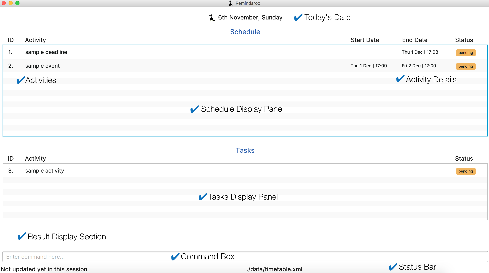 
  Figure 1: GUI of Remindaroo 

5. Type the command in the command box and press <kbd>Enter</kbd> to execute it.  
6. The following are some examples of commands you can try:
   * **`add`**`return Paul $10`
   * **`help`**
   * **`exit`**
7. Refer to the [Commands](#3-commands) section below for details of each command. 

<!-- @@author A0139797E -->
## 3. Commands

There are many commands in Remindaroo that you can take advantage of. Formatting notations used in Remindaroo are as follows:

* Words in `UPPER_CASE` are the parameters to be specified.
* Items in `[SQUARE_BRACKETS]` are optional parameters.
* Keywords with the character `|` in between indicates that either one can be used.
* Order of parameters specified are fixed.
* Keywords in Remindaroo are case-insensitive.

> **Note:** 
> An unrecognized command will be highlighted in red. Additionally, command words are case-insensitive as well. 

In addition, date and time parameters are also supported. `DATE_TIME`, `START_DATE_TIME` and `END_DATE_TIME` are parameters that can accept a variety of inputs indicating a specific date and/or time. Some examples include:
* Date, e.g. `29 Oct`
* Date and time, e.g. `10 Nov 09:00`, `10 Nov 9am`
* Relative day, e.g. `tomorrow`, `tmr`
* Specific weekday, e.g. `Wednesday`, `wed`

> **Note:** 
> If the timing is not specified, it will be set as the current timing. Additionally, `START_DATE_TIME` must be earlier than or be the same as `END_DATE_TIME`. 

###  3.1 Add New Activity : **`add`**
Adds an activity into Remindaroo. 3 types of activities are recognized, namely:
* _Task_ : An activity without a specific time
* _Deadline_ : An activity with a specific time
* _Event_ : An activity with a specific start time and end time

##### Formats: 
**`add TASK`** 
**`add DEADLINE on|by DATE_TIME`** 
**`add EVENT from START_DATE_TIME to END_DATE_TIME`** 
**`add DEADLINE_AND_TIME|EVENT_AND_TIMES for NUM TIME_UNIT`** 

#####Examples: 

**\>\> `add buy milk`**  
Remindaroo has added buy milk into the task panel. 

**\>\> `add submit assignment 1 by 1 Nov 09:00`**  
Remindaroo has added “submit assignment 1” with a due date on 1st November, 9am. 

**\>\> `add Football Tournament from 1 Dec 08:00 to 1 Dec 10:00`**  
Remindaroo has added “Football Tournament” which will be held on 1st December, 8am to 10am. 

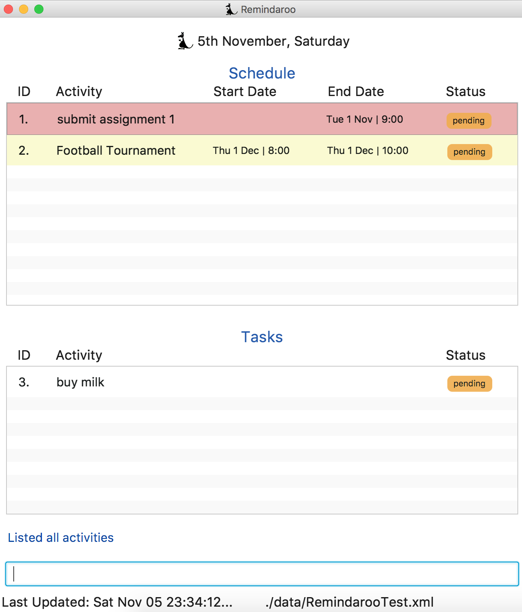 
Figure 2: Add task and deadline to Remindaroo. 

> **Note** 
> Deadlines and events that have passed will be highlighted red to alert you. 

<!-- @@author A0135730M -->
**\>\> `add weekly meeting on from 7 nov 2pm to 7 nov 4pm for 3 weeks`**  
Remindaroo has added your weekly meeting, beginning on 7 November, 2pm – 4pm for the next 3 weeks. This is an example of a recurring activity. 

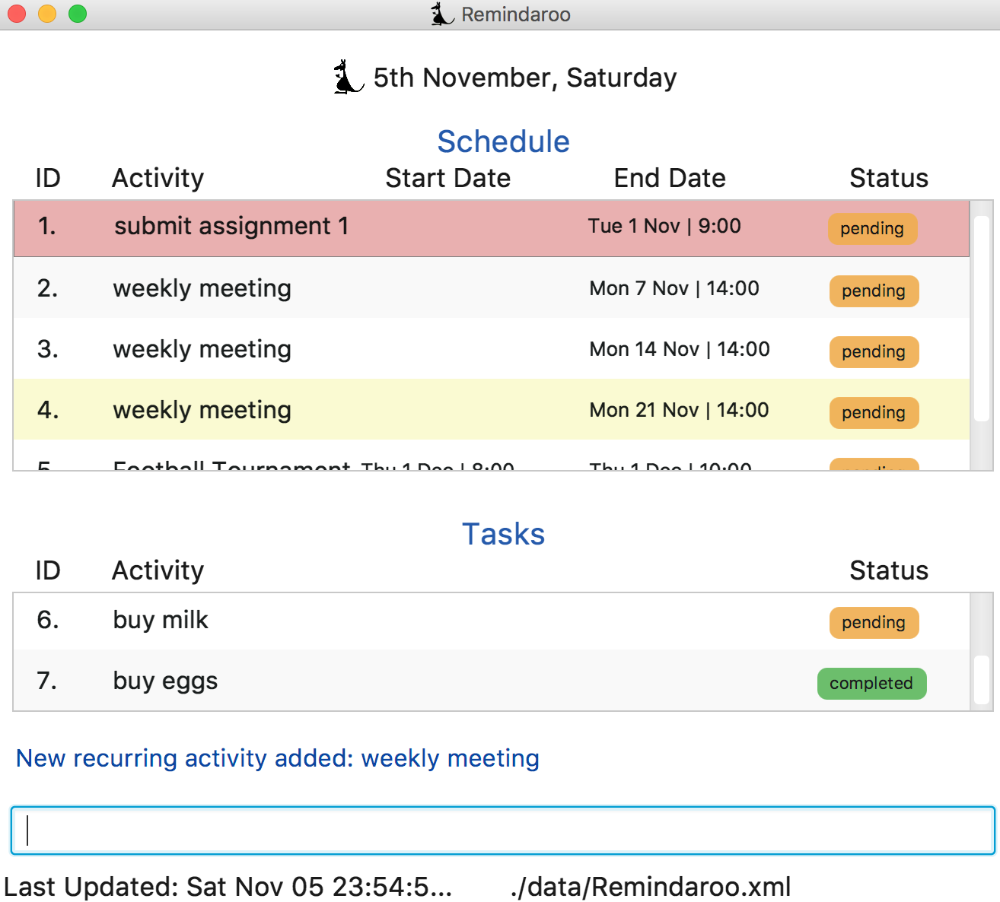 
Figure 3: Add recurring tasks to Remindaroo. 

> **Note** 
> Possible TIME_UNIT values include days, weeks, months and years

<!-- @@author A0144881Y -->
###  3.2 List all Activities : **`list`**
Displays all activities in Remindaroo.

##### Format:
**`list`**

##### Examples:
**\>\> `list`** 
Remindaroo display a list of all activities, including completed activities, such as “buy eggs”.

 
Figure 4: List all activities in Remindaroo. 

> **Note:** 
Completed activities are shown at the bottom of each panel

###  3.3 Clear all Activities : **`clear`**
Removes all activities from Remindaroo.

##### Format:
**`clear`**

##### Examples:
**\>\> `clear`** 
Remindaroo removes all tasks, deadlines and events, allowing you to start from a blank state.

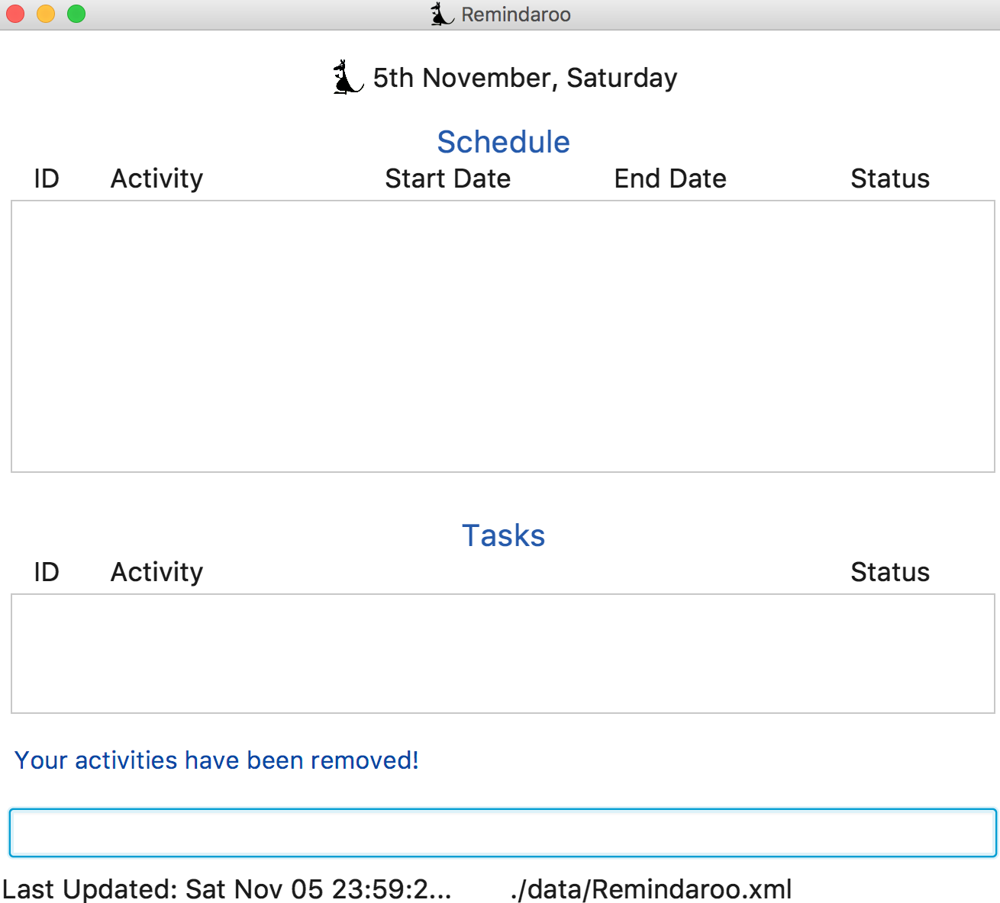 
Figure 5: Clear all activities in Remindaroo. 

<!-- @@author A0144704L -->
###  3.4 Delete Activity : **`delete`**
Deletes a specific activity in Remindaroo.

##### Format: 
**`delete ACTIVITY_ID`** 

##### Example:
**\>\> `delete 1`** 
Activity with ID 1 (submit assignment 1) is now deleted from Remindaroo.

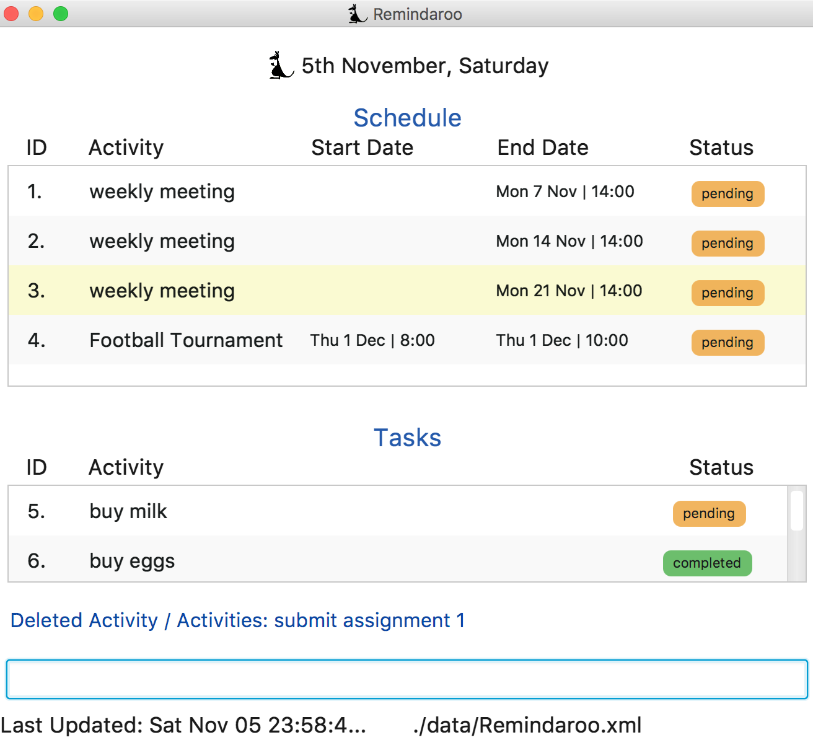 
Figure 6: Delete activity with index 1. 

> **Note:** 
> Multiple activities can be deleted in a single command. For instance, to delete weekly meetings with IDs 1, 2 and 3, simply type the command: `delete 1 2 3`

###  3.5 Update Activity : **`update`**
Updates the name, date and/or time of a specific activity to a newly specified value.

##### Formats: 
**`update ACTIVITY_ID NEW_NAME`** 
**`update ACTIVITY_ID [NEW_NAME] on|by DATE_TIME`** 
**`update ACTIVITY_ID [NEW_NAME] from [START_DATE_TIME] to [END_DATE_TIME]`** 

##### Examples: 

**\>\> `update 2 buy cheese`** 
Activity with ID 2 now indicates that we should “buy cheese” instead.

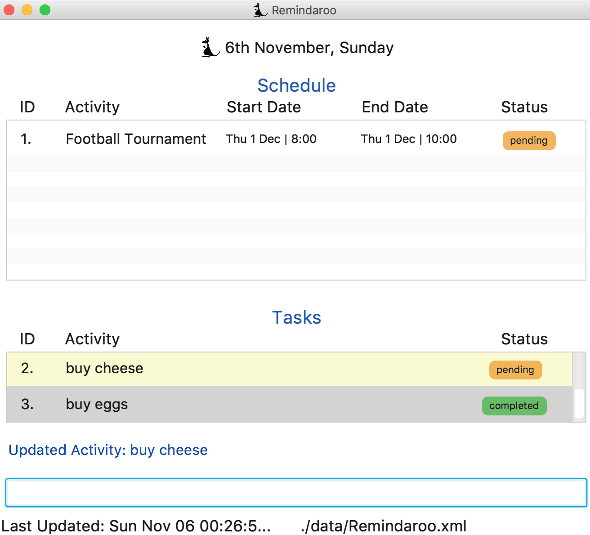 
Figure 7: Update activity 2 with a new name. 

**\>\> `update 2 by 5pm`** 
Activity with ID 2 now becomes a deadline, indicating that we should “buy cheese” by 5pm today. Realize that the ID has changed from 2 to 1.

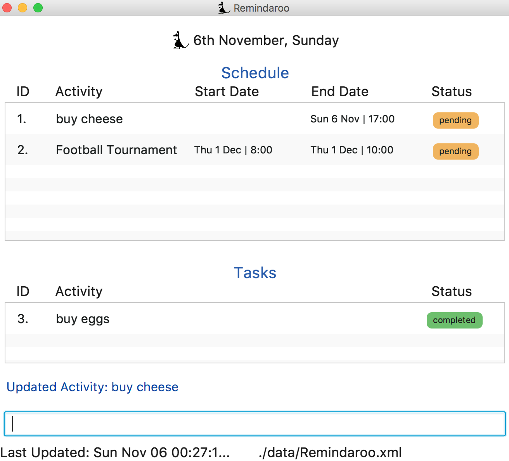 
Figure 8: Update activity 2 from task to deadline. 

**\>\> `update 1 from 2pm to 3pm`** 
Activity with ID 1 now becomes an event, indicating that we should “buy cheese” between 2pm to 3pm today instead because we are unavailable at 5pm.

<!-- @@author A0135730M -->
###  3.6 Search for activities : **`search`**
Displays a list of activities matching keywords, a specific time frame or status.

##### Formats: 
**`search "Keywords"`** 
**`search DATE_TIME [to DATE_TIME]`** 
**`search pending|completed`** 

##### Examples: 

**\>\> `search "buy"`** 
Activities with the keyword “buy” is shown (2 activities in total).

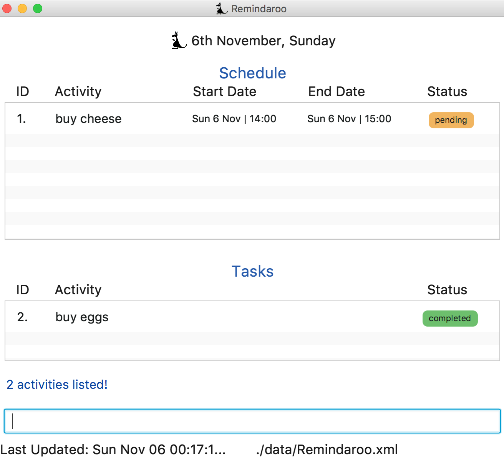 
Figure 9: Search keywords. 

**\>\> `search today`** 
Activities that are due today or happen today will be shown (1 activity in total).

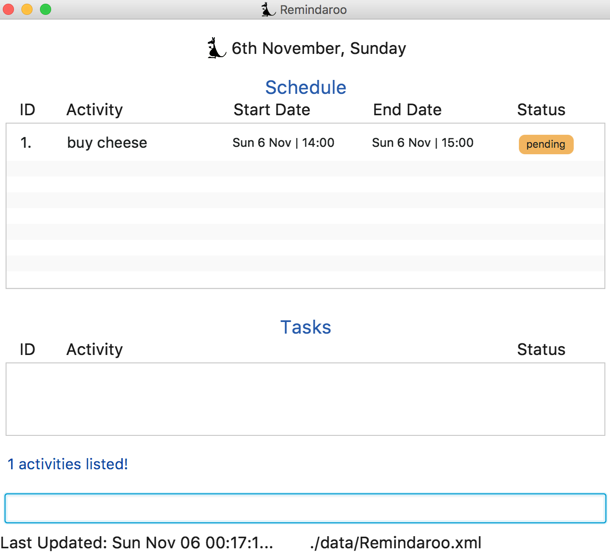 
Figure 10: Search datetime. 

**\>\> `search completed`** 
Activities that are completed will be shown (1 activity in total).

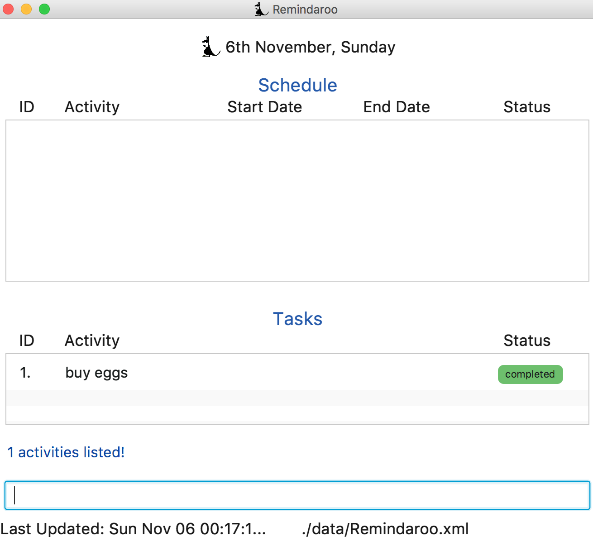 
Figure 11: Search completed. 

> **Note:** 
> Multiple keywords can be specified at once, and single quotes can be used as well.

###  3.7 Mark An Activity : **`mark`**
Mark an activity as completed. All completed activities are no longer displayed.

##### Format: 
**`mark ACTIVITY_ID`** 

##### Example: 
**\>\> `mark 1`** 
Activity with ID 1 is now completed, which means we have bought cheese.

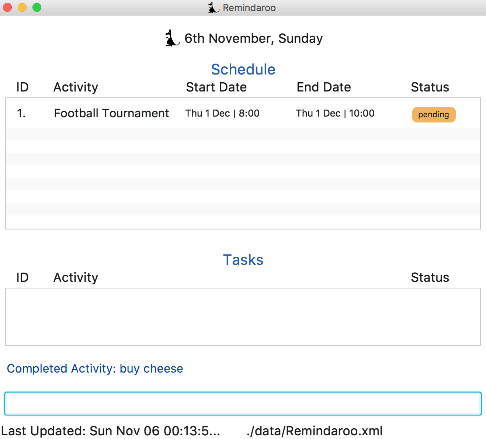 
Figure 12: Mark an activity as completed. 

###  3.8 Unmark An Activity : **`unmark`**
Marks a completed activity as pending. Activity will be displayed in the associated panel.

##### Format: 
**`unmark ACTIVITY_ID`** 

##### Example:
**\>\> `search completed`** 
**\>\> `unmark 1`** 
List of completed activities are shown. Activity with ID 1 is then marked as pending (i.e. still need to buy cheese).

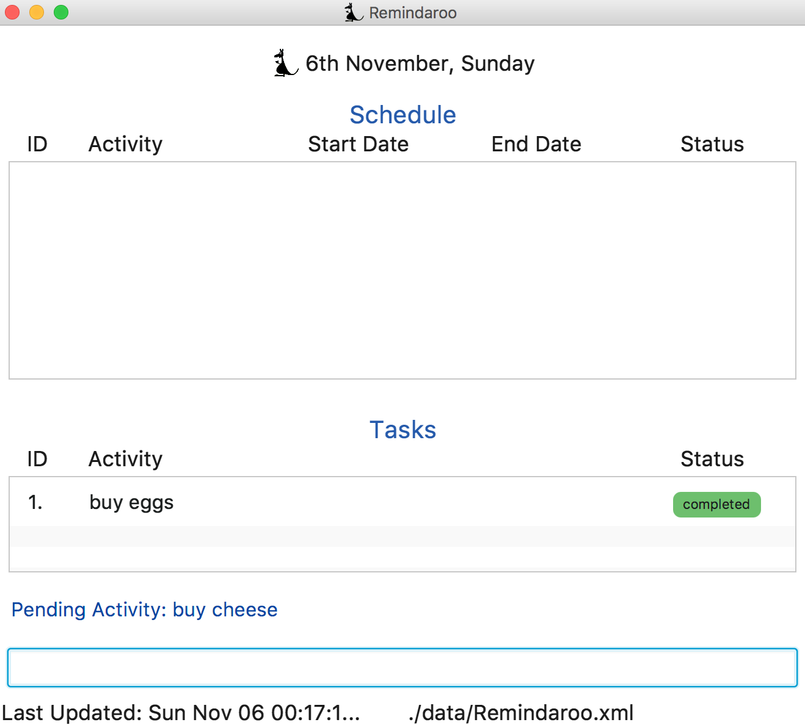 
Figure 13: Mark an activity as not completed. 

<!-- @@author A0139797E -->
###  3.9 Undo last command: **`undo`**
Reverts Remindaroo to the last changed state by undoing previous commands.

##### Format: 
**`undo [NUMBER_OF_TIMES]`** 

##### Example:
**\>\> `add buy carrot`** 
**\>\> `add buy potatoes`** 
**\>\> `undo 2`** 
The commands that add “buy carrot” and “buy potatoes” are being undone.

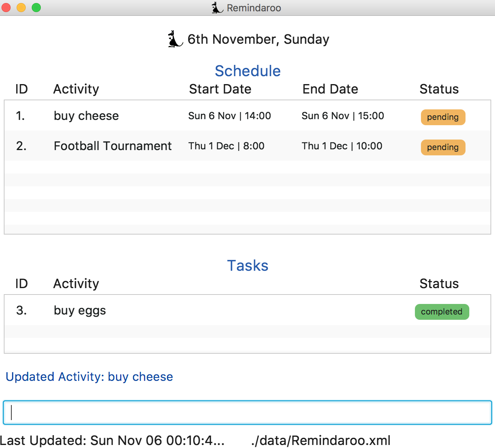 
Figure 14: Undo two commands. 

> **Note:** 
> You can only undo commands used in the current session.

###  3.10 Redo last command: **`redo`**
Redoes a previously undone command.

##### Format: 
**`redo [NUMBER_OF_TIMES]`** 

##### Example:
**\>\> `redo`** 
The command to add “buy carrot” is being redone, thus adding a task.

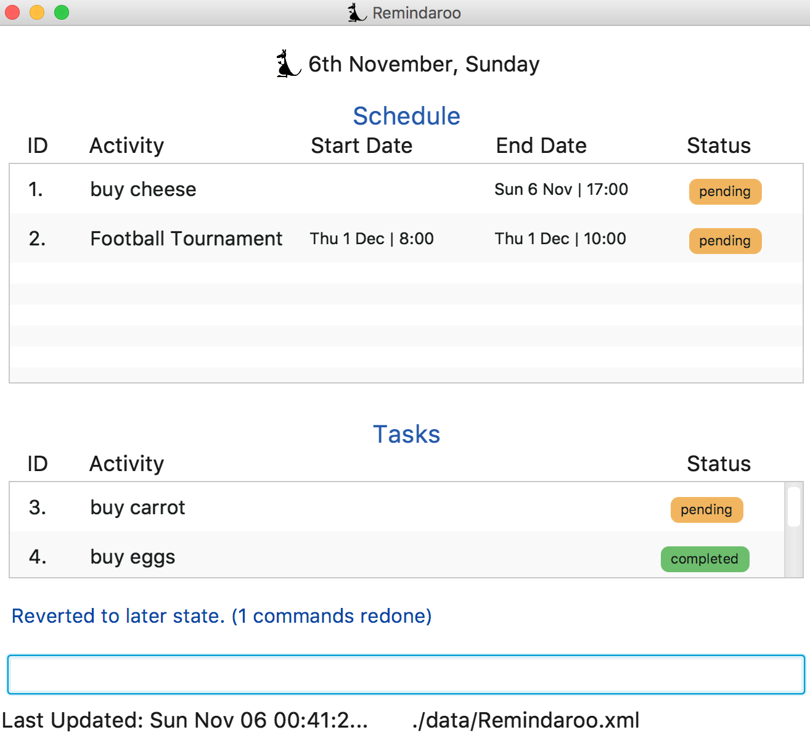 
Figure 15: Redo one command. 

> **Note:** 
> You can only redo commands that were just undone. If another command is entered after undo, then redoing a command is no longer possible.

<!-- @@author A0144704L -->
###  3.11 Load from file: **`load`**
Loads an existing .xml file with a Remindaroo schedule, which overwrites the current one.

##### Format: 
**`load DATE_FILE_PATH`** 

##### Example:
**\>\> `load data/backup.xml`** 
Remindaroo retrieves activities in data/backup.xml, which replaces your current schedule.

 
Figure 16: Load a data file into Remindaroo. 

> **Note:** 
> The data file path should be specified relative to Remindaroo’s current directory.

###  3.12 Store to file: **`store`**
Changes the .xml file which Remindaroo stores your schedule in.

##### Format: 
**`store NEW_DATE_FILE_PATH`** 

##### Example:
**\>\> `store data/timetable.xml`** 
Remindaroo now stores your activities in data/timetable.xml. The status bar will reflect this change as well.

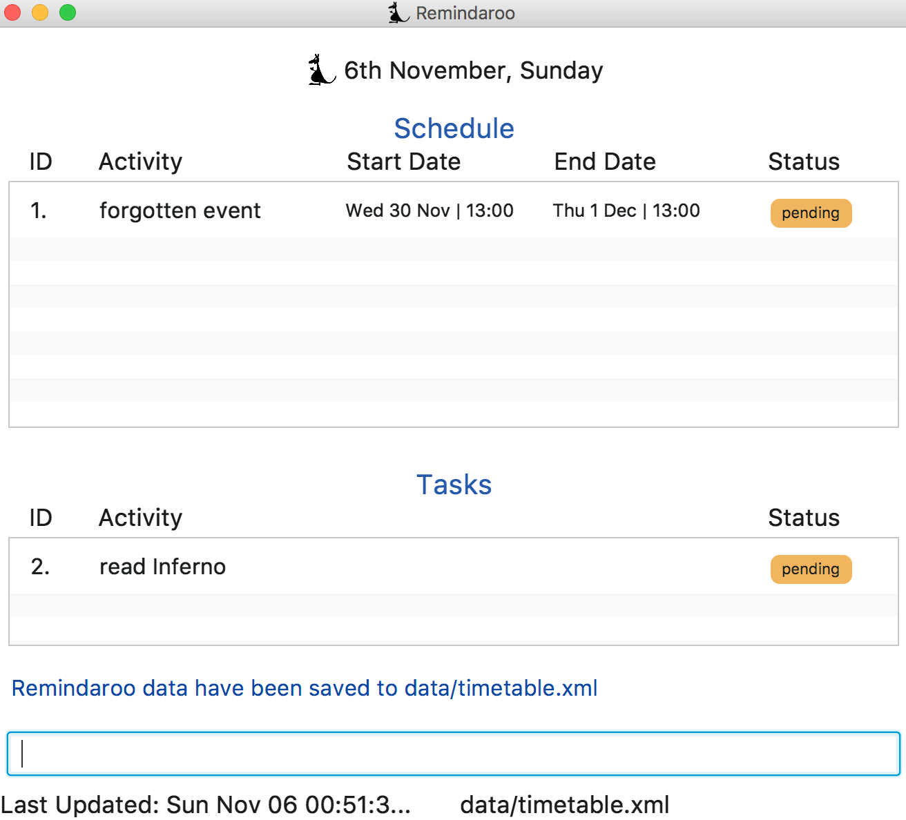 
Figure 17: Change data file path in Remindaroo. 

> **Note:** 
> The data file path should be specified relative to Remindaroo’s current directory.

###  3.13 Show help menu: **`help`**
Displays the help window, which contains instructions and examples for using each of the commands.

##### Format: 
**`help`** 

##### Example:
**\>\> `help`** 
The help window for Remindaroo is automatically displayed.

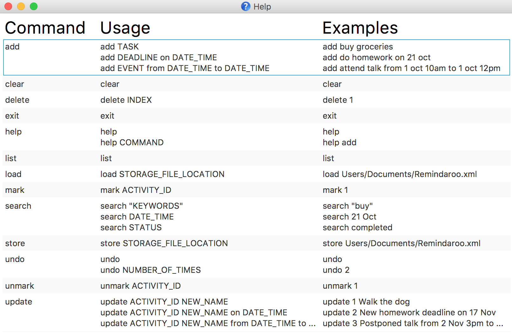 
Figure 18: Help window. 

> **Note:** 
> The help window is also accessible by pressing the F1 hotkey on your keyboard.

###  3.14 Exit the application: **`exit`**
Exits Remindaroo.

##### Format: 
**`exit`** 

##### Example:
**\>\> `exit`** 
Remindaroo’s main window is closed.

> **Note:** 
> Remindaroo saves data automatically after any command that has changed your existing data. There is no need to save manually, even before exiting.

<!-- @@author A0144881Y -->
## 4. Summary of Commands

| Commands        | Format        |
| ----------------|---------------|
| Add a task | `add TASK` |
| Add a deadline | `add DEADLINE on|by DATE_TIME` |
| Add an event | `add EVENT from START_DATE_TIME to END_DATE_TIME` |
| Add a recurring deadline or event | `add DEADLINE_AND_TIME|EVENT_AND_TIME for NUM TIME_UNIT` |
| List all activities | `list` |
| Clear all activities | `clear` |
| Delete activity | `delete ACTIVITY_ID`|
| Delete activities | `delete ACTIVITY_ID1 ACTIVITY_ID2 ...`|
| Update Activity | `update ACTIVITY_ID [NEW_NAME] on|by [DATE_TIME]` `update ACTIVITY_ID [NEW_NAME] from [DATE_TIME] to [END_DATE_TIME]` |
| Mark activity   | `mark ACTIVITY_ID` |
| Unmark activity   | `unmark ACTIVITY_ID` |
| Search Activity | `search “KEYWORDS”|‘KEYWORDS’` `search DATE_TIME [to END_DATE_TIME]` `search pending|completed`|
| Undo a command | `undo [NUMBER_OF_TIMES]` |
| Redo a command | `redo [NUMBER_OF_TIMES]` |
| Load data from file | `load DATA_FILE_PATH` |
| Store data into file | `store NEW_DATE_FILE_PATH` |
| Show help menu | `help` |
| Exit the application | `exit` |

## 5. Troubleshooting

**Question: How do I transfer my data to another computer?** 
Install the application in the other computer and transfer the .xml file containing your schedule to your other computer as well. After which, use the command load to retrieve your schedule once again.

**Question: Why is it that Remindaroo cannot be opened by any application?**
Install Java (version 1.8.0_60 above) onto your computer. Following which, right click on Remindaroo’s icon, and click “Open with...”. Select “Java binary archive” and you are good to go.
