# User Guide
## 1. Table of Contents

1. [Table of Contents](#1-table-of-contents)
2. [About](#2-about)
3. [Getting Started](#3-getting-started)
4. [Commands](#4-commands)
5. [Summary of Commands](#5-summary-of-commands)
6. [Troubleshooting](#6-troubleshooting)

<!-- @@author A0144704L -->
## 2. About

Remindaroo is a customized to-do list application that can help you manage your busy schedule and organize your to-dos. Whether its working on a project, buying groceries or planning a holiday, Remindaroo aims to help you get stuff done. So let's get started!

## 3. Getting Started

1. Ensure you have Java version `1.8.0_60` or later installed in your Computer. 
   > Having any Java 8 version is not enough.  
   This app will not work with earlier versions of Java 8.

2. Download the latest `remindaroo.jar` from the [releases](../../../releases) tab.
3. Copy the file to the folder you want to use as the home folder for Remindaroo.
4. Double-click the file to start the app. The Graphical User Interface (GUI) should appear in a few seconds.

> 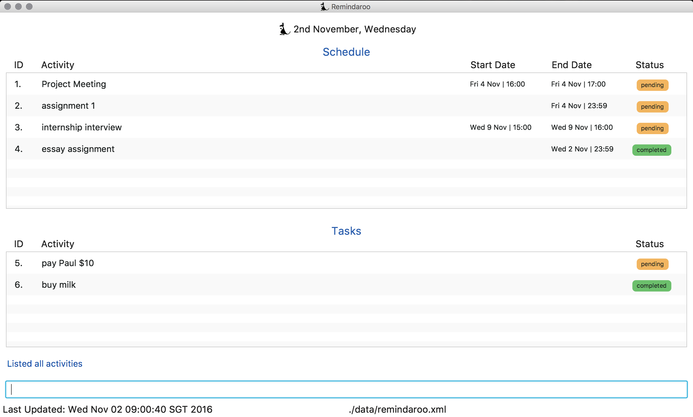 
> Figure 1: GUI of Remindaroo

5. Type the command in the command box and press <kbd>Enter</kbd> to execute it.  
   e.g. type **`help`** and press <kbd>Enter</kbd> to open the help window.
6. Some examples of commands you can try:
   * **`add`**`buy bread` : adds a task named `buy bread` to Remindaroo
   * **`exit`** : exits the app
7. Refer to the [Commands](#4-commands) section below for details of each command. 

<!-- @@author A0139797E -->
## 4. Commands

> Format notations:
>
> * Words in `UPPER_CASE` are the parameters
> * Items in `[SQUARE_BRACKETS]` are optional
> * Keywords with `|` in between indicates that either one can be used
> * Order of parameters are fixed
> * Keywords are case-insensitive

 

> Special note on Date and Time parameters:
>
> `DATE_TIME`, `START_DATE_TIME` and `END_DATE_TIME` are parameters that can accept various inputs indicating a specific date or time. Some examples are as follows
> * Date, e.g. `29 Oct`
> * Date and time, e.g. `10 Nov 09:00`
> * Relative day, e.g. `tomorrow`
> * Specific weekday, e.g. `wednesday`
>

> Note: If the timing is not specified, it will be set as the current timing.
> Note: START_DATE_TIME must be earlier than or equal to END_DATE_TIME.

###  4.1 Add New Activity : **`add`**
Adds an activity into Remindaroo. 3 types of activities are available:
* _task_ : one without specific time
* _deadline_ : one with just a specific time
* _event_ : one with a start time and end time

##### Formats:  
-  `add TASK` 

	> Example:  
	> `add buy milk`  
	>
	> Screenshot:  
	> 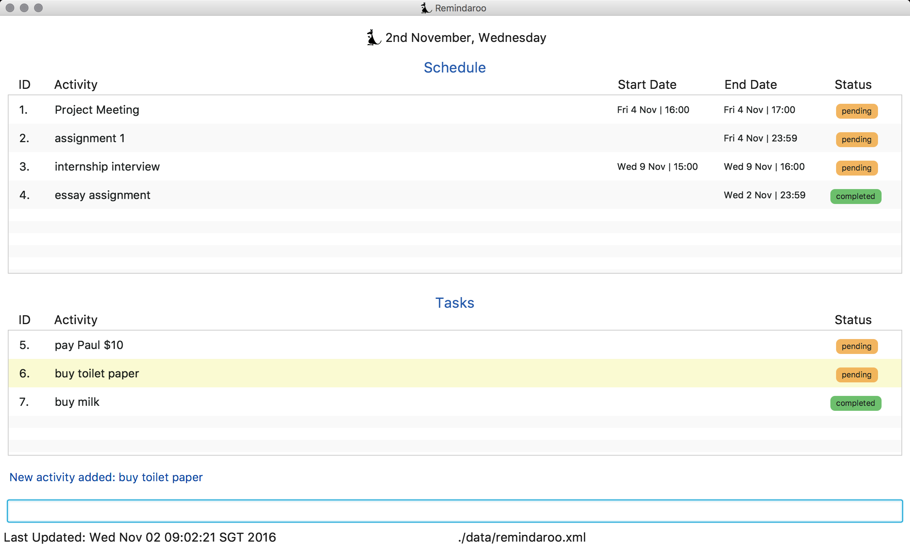  
	> Figure 2: After entered command `add buy toilet paper`  

-  `add DEADLINE on|by DATE_TIME` 

	> Example:  
	> `add Submit Assignment 1 on 23 Oct`  
	> `add Submit Assignment 1 by 23 Oct 09:00`  
	>
	> Screenshot:  
	> 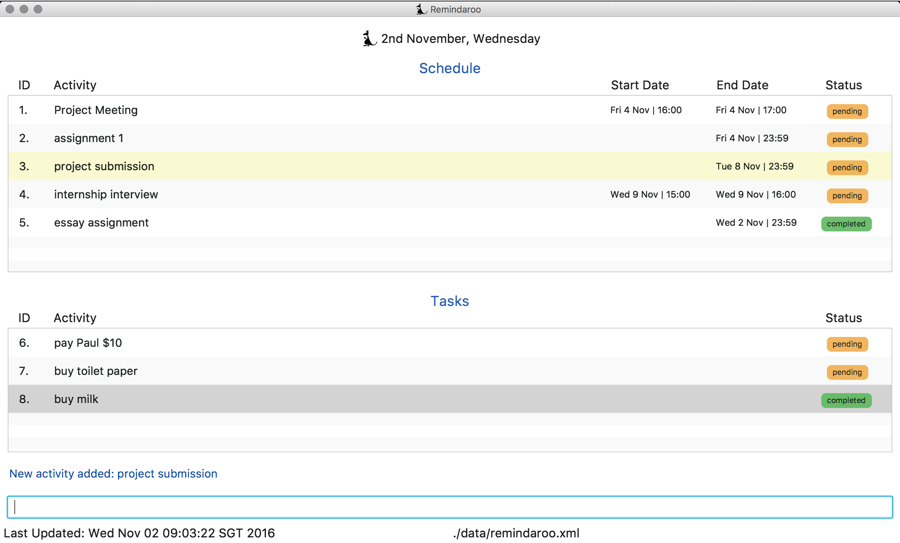  
	> Figure 3: After entered command `add project submission by next tues 23:59`  

- `add EVENT from START_DATE_TIME to END_DATE_TIME` 

	> Example:  
	> `add Football Tournament from 21 Oct 08:00 to 23 Oct 22:00`  
	> `add Football Tournament from 21 Oct to 23 Oct`  
	>
	> Screenshot:  
	> 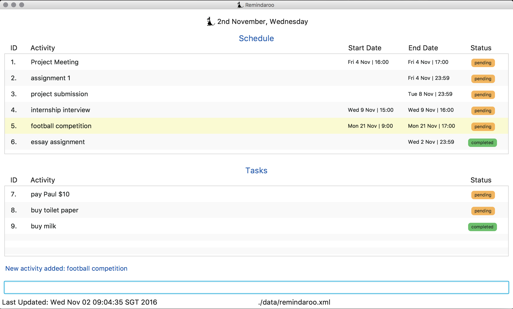  
	> Figure 4: After entered command `add football competition from 21st nov 9am to 21st nov 5pm`  

<!-- @@author A0135730M -->
##### Note:  
-	Recurring deadlines / events can be added using just an `add` command, by appending ` for RECUR_NUM TIME_UNIT` to it, where `RECUR_NUM` is any positive integer, and `TIME_UNIT` is either `day`, `week`, `month`, `year` (case-insensitive, accepts both singular and plural form).
	> Example:  
	> `add transfer window closing on 31 oct for 3 years`  
	> `add monthly meeting from 1 Oct 1pm to 1 Oct 3pm for 5 months`  
	>
	> Screenshot:  
	> 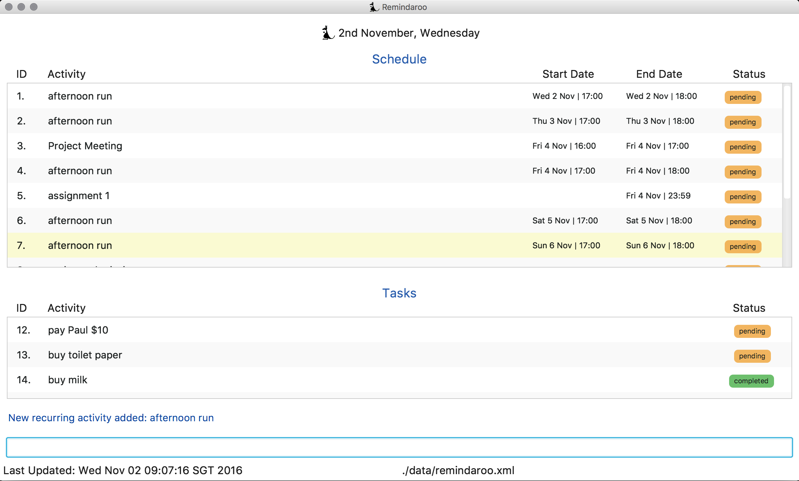  
	> Figure 5: After entered command `add afternoon run from today 5pm to today 6pm for 5 days`  

-  If activity name contains keywords, add quotation marks to the keywords that separate the name and time.
	> Example:  
	> `add read All by Me "by" 23 Oct`  
	> `add screening from Tokyo to Paris "from" 21 Oct "to" 23 Oct`  

<!-- @@author A0144881Y -->
###  4.2 List all Activities : **`list`**
Displays all activities in Remindaroo

##### Format:
- `list`

###  4.3 Clear all Activities : **`clear`**
Clear all activities in Remindaroo

##### Format:
- `clear`

###  4.4 Delete Activity : **`delete`**
Deletes a specific activity from Remindaroo

##### Format:  
- `delete ACTIVITY_ID` 

	> Example:  
	> `delete 1`  
	> Activity with ID 1 (e.g. `Football Practice`) is deleted from the Remindaroo
	>
	> Screenshot:  
	> 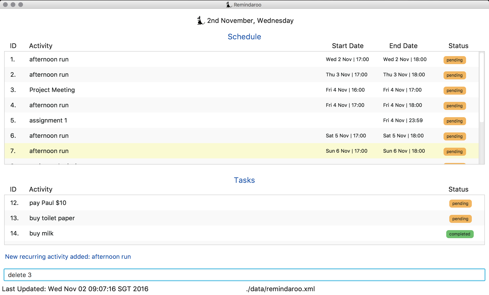  
	> Figure 6: Command to type in order to delete event "Project Meeting"  
	>
	> 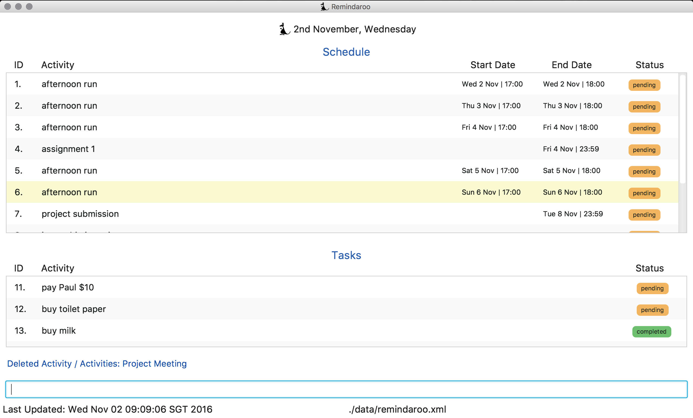  
	> Figure 7: After entered command `delete 3`  

###  4.5 Update Activity : **`update`**
Updates name, date and/or time of specific activity to specified name, date and/or time.

##### Format:  
-  `update ACTIVITY_ID [NEW_NAME] from [DATE_TIME] to [END_DATE_TIME]` 

	> Examples: 
	> `update 1 buy bread` 
	> Activity with ID 1 is updated to `buy bread` 
	>
	> `update 2 on 10 Oct 10:00` 
	> Activity with ID 2 is updated to be on / due by 10 October, 10:00 
	>
	> `update 3 from 11 Oct 13:00 to 11 Oct 14:00` 
	> Activity with ID 3 is updated to be on 11 October, 13:00 to 14:00 
	>
	> Screenshot:  
	> 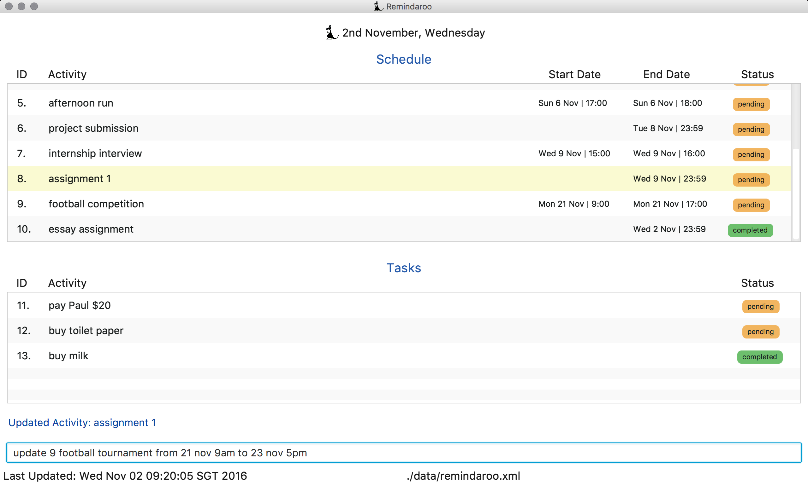  
	> Figure 8: Command to type in order to update event "football competition"  
	>
	> 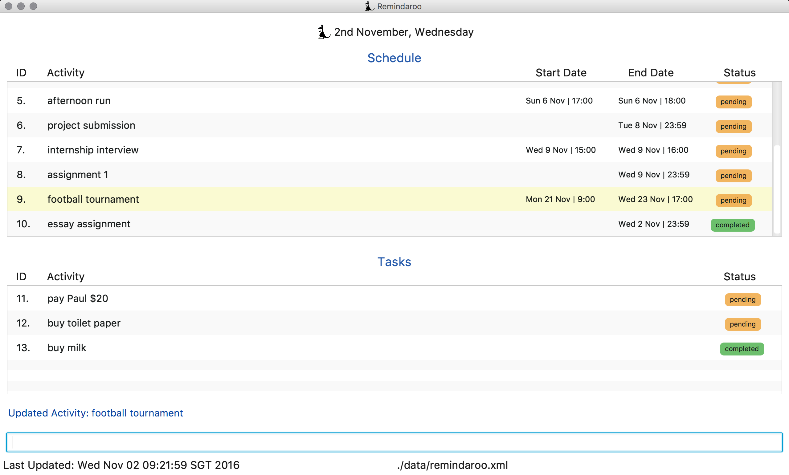  
	> Figure 9: After entered command `update 9 football tournament from 21 nov 9am to 23 nov 5pm`  

<!-- @@author A0144704L -->
###  4.6 Mark Activity : **`mark`**
Marks an activity as completed. Displays remaining pending activities.

##### Format:  
- `mark ACTIVITY_ID` 

	> Example: 
	> `mark 1` 
	> Activity with ID 1 (e.g. `do assignment 1`) is marked as completed
	>
	> Screenshot:  
	> 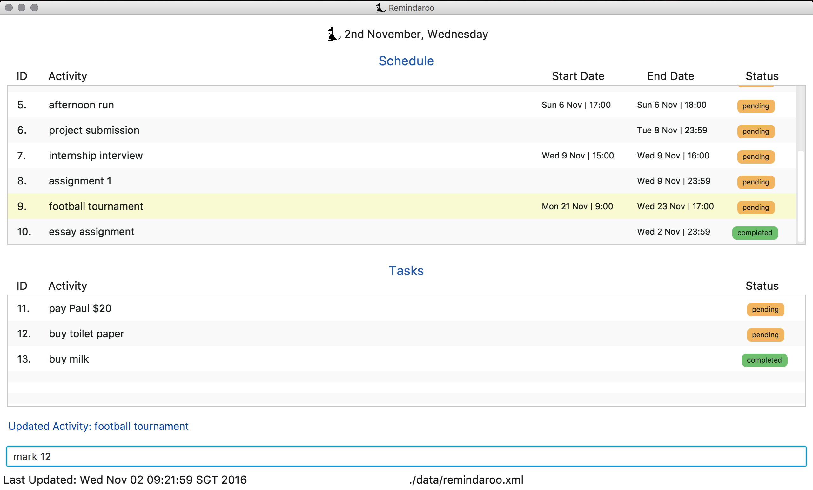  
	> Figure 10: Command to type in order to mark task "buy toilet paper"  
	>
	> 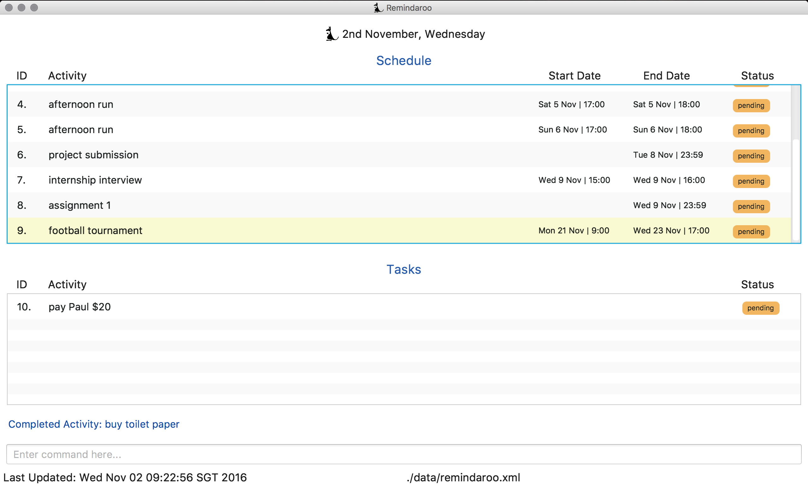  
	> Figure 11: After entered command `mark 12`  

###  4.7 Unmark Activity : **`unmark`**
Unmarks an activity as pending. Displays remaining pending activities.

##### Format:  
- `unmark ACTIVITY_ID` 

	> Example: 
	> `unmark 1` 
	> Activity with ID 1 (e.g. `do assignment 1`) is unmarked as pending

<!-- @@author A0135730M -->
###  4.8 Search for Activities : **`search`**
Displays list of activities that match description (keywords / date / status)
If search by keywords, add quotation marks (either ' or ") around keywords.

##### Formats:  
- `search KEYWORDS` 

	> Example: 
	> `search "CS2101 tutorial"` 
	> `search 'Assignment 1'` 
	>
	> Screenshot:  
	> 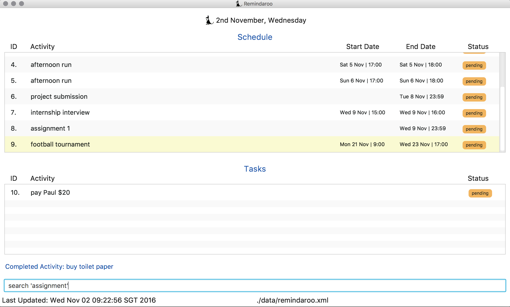  
	> Figure 12: Command to type in order to search for activity with "assignment"  
	>
	> 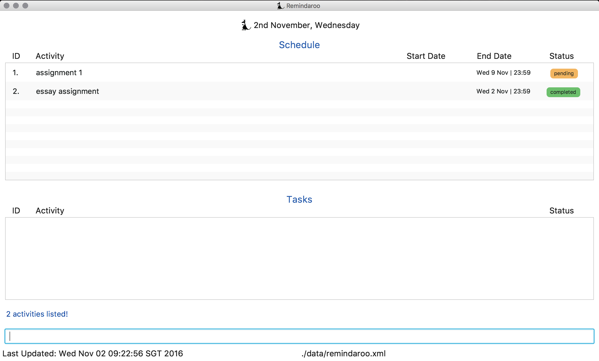  
	> Figure 13: After entered command `search 'assignment'`  

- `search DATE_TIME [to END_DATE_TIME]` 

	> Example: 
	> `search today` 
	> `search 21 Oct to 23 Oct` 
	>
	> Screenshot:  
	> 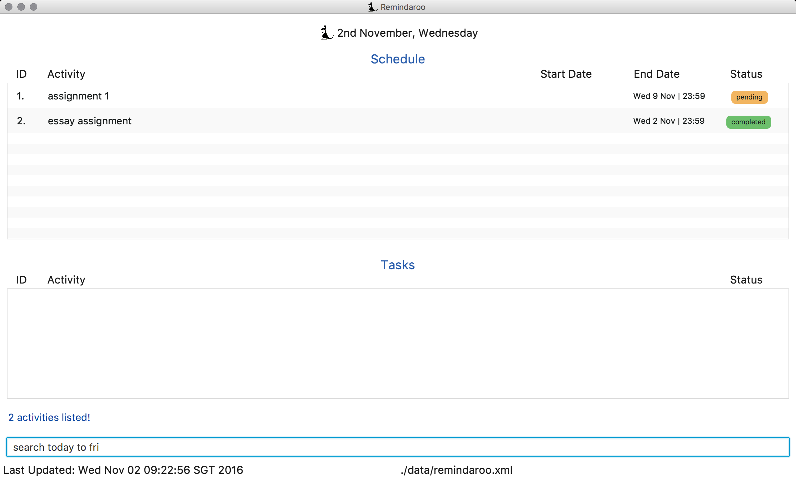  
	> Figure 14: Command to type in order to search for activities between today (Wednesday) and Friday  
	>
	> 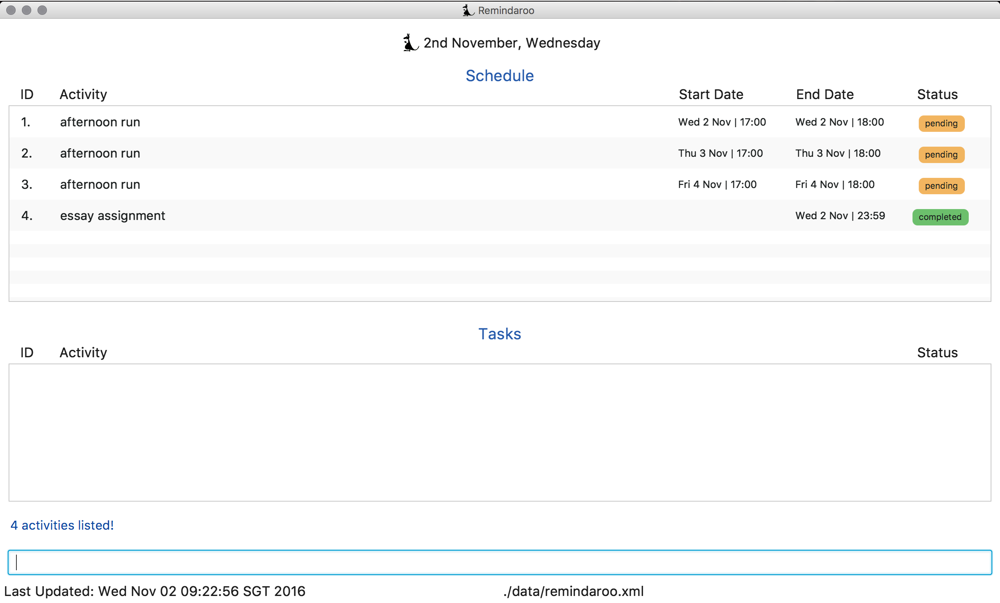  
	> Figure 15: After entered command `search today to fri`  

- `search STATUS` 

    > Example: 
    > `search pending` 
    > `search completed` 

<!-- @@author A0139797E -->
###  4.9 Undo last command : **`undo`**
Undoes last N command(s) entered (default N equals 1).

##### Format:  
- `undo [NUM_OF_TIMES]` 

	>  Example: 
	>  `add CS2101 Tutorial` 
	>  `add CS2103 Tutorial` 
	>  `undo 2` 
	>  CS2101 tutorial and CS2103 Tutorial are removed from Remindaroo
	>
	> Screenshot:  
	> 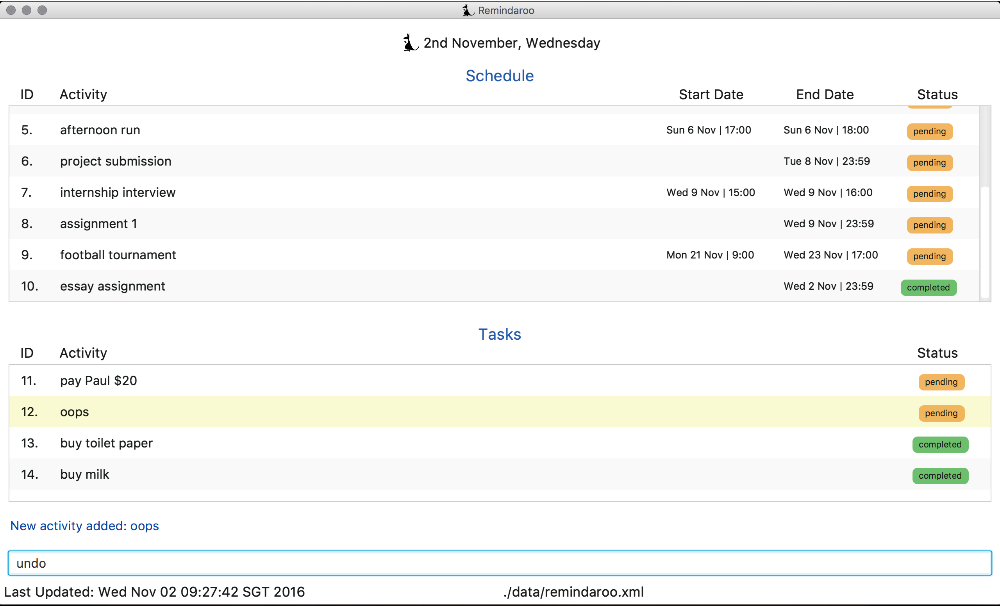  
	> Figure 16: Command to type in order to undo previous command  
	>
	> 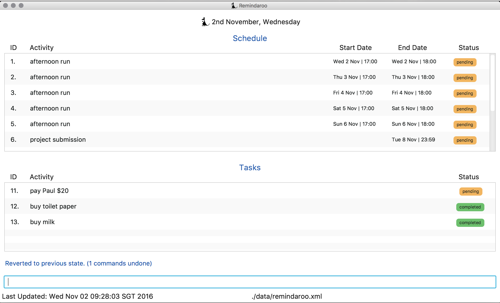  
	> Figure 17: After entered command `undo`  

###  4.10 Redo last command: **`redo`**
Redoes last N undo command(s) (default N equals 1).

##### Format:  

- `redo [NUM_OF_TIMES]` 

	>  Example: 
	>  `add CS2101 Tutorial` 
	>  `add CS2103 Tutorial` 
	>  `undo 2` 
	>  `redo 2` 
	>  CS2101 tutorial and CS2103 Tutorial are re-added to Remindaroo
	>
	> Screenshot:  
	> 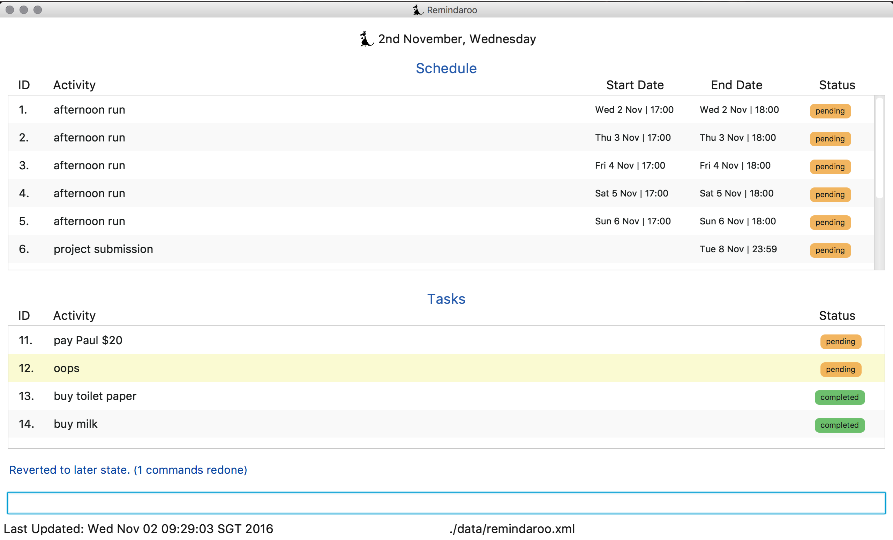  
	> Figure 18: After entered command `undo` from Figure 17  

<!-- @@author A0144704L -->
###  4.11 Change Data Storage Location : **`store`**
Changes the location of the data file of Remindaroo to the specified path (relative to the directory of the Remindaroo app).

##### Format: 

- `store NEW_DATA_FILE_LOCATION` 

	> Example: 
	> `store new_data/Remindaroo.xml` 
	> The Data file `Remindaroo.xml` now resides in the folder `new_data`
	>
	> Screenshot:  
	> 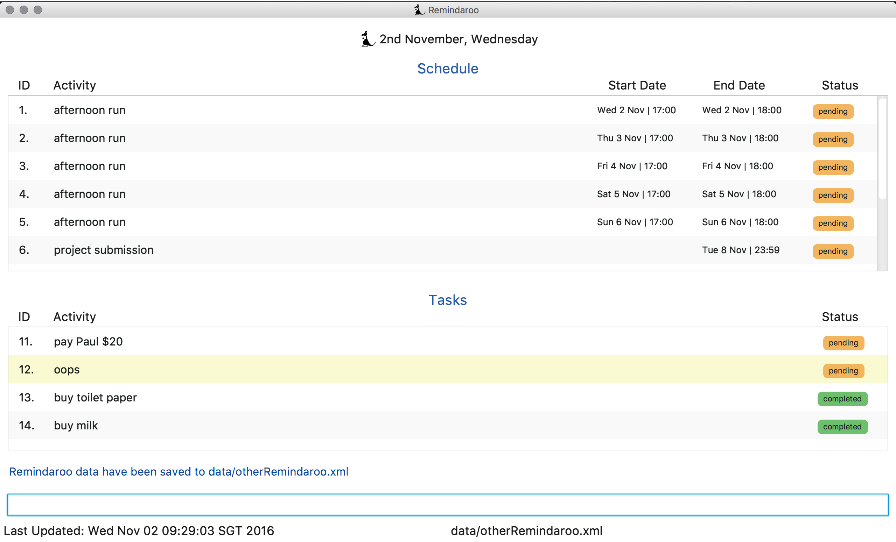  
	> Figure 19: After entered command `store data/otherRemindaroo.xml`  

###  4.12 Show Help Menu : **`help`**
Displays the help window, which contains instructions for using each of the commands

##### Format:  

- `help` 

	> Screenshot:  
	> 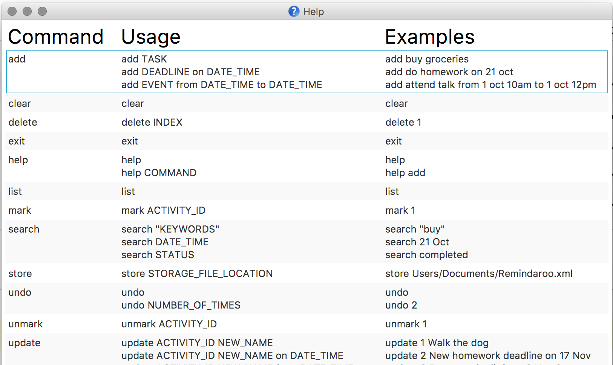  
	> Figure 20: After entered command `help`  

###  4.13 Exit Remindaroo : **`exit`**
Exits the program

##### Format:  
- `exit`

###  4.14 Saving the data
ActivityManager data is saved in the hard disk automatically after any command changes the data.
There is no need to save manually.
 

<!-- @@author A0144881Y -->
## 5. Summary of Commands

| Commands        | Format        |
| ----------------|:-------------:|
| Add Task | `add TASK` |
| Add Deadline | `add DEADLINE on|by DATE_TIME` |
| Add Event | `add EVENT from START_DATE_TIME to END_DATE_TIME` |
| Add Recurring Deadline / Event | `add DEADLINE_AND_TIME|EVENT_AND_TIME for RECUR_NUM TIME_UNIT` |
| List all Activities | `list` |
| Clear all Activities | `clear` |
| Delete Activity | `delete ACTIVITY_ID`|
| Update Activity | `update ACTIVITY_ID [NEW_NAME] from [DATE_TIME] to [END_DATE_TIME]` |
| Mark Activity   | `mark ACTIVITY_ID` |
| Unmark Activity   | `unmark ACTIVITY_ID` |
| Search Activity | `search KEYWORDS | DATE_TIME [to END_DATE_TIME] | STATUS`
| Undo            | `undo [NUMBER_OF_TIMES]` |
| Redo            | `redo [NUMBER_OF_TIMES]` |
| Change data storage location | `store NEW_DATA_FILE_LOCATION` |
| Help            | `help` |
| Exit            | `exit` |

## 6. Troubleshooting

**Q:** How do I transfer my data to another computer? 
**A:** Install the app in the other computer and overwrite the empty data file it creates with the file that contains the data of your previous Remindaroo folder.
